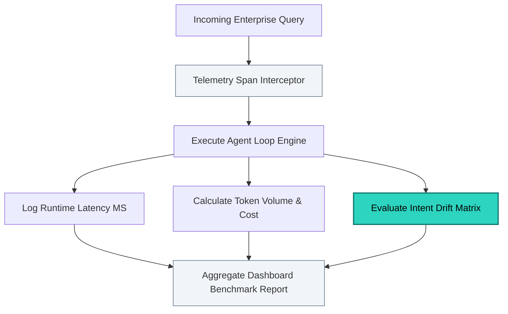

# 👁️ Agent Observability & Regression Evaluation Harness

## 🌐 Executive Summary
This repository contains an enterprise agentic observability tracing pipeline designed to audit multi-agent system workflows in live runtime environments. 

Utilizing OpenTelemetry structure rules, the framework monitors system performance vectors—specifically execution latency spikes, localized token consumption thresholds, and dynamic API resource spend. Additionally, the system includes an automated evaluation runner that maps incoming requests against regression benchmarks to detect intent-drift or behavioral regressions before software updates hit production pipelines.

---

## 🏗️ Observability Tracing & Telemetry Loop
The architecture intercepts tool calls and processing nodes to calculate infrastructure overhead and monitor response quality. Below is the operational tracing blueprint:



---

## 🔧 Operational Optimization Features

### 1. Granular Production Token Profiling
The engine breaks down processing metrics across isolated trace blocks to prevent unexpected API billings:
* **Cost Accounting**: Separates Input and Output strings to calculate running enterprise budgets down to the individual token.
* **Latency Safeguards**: Captures system delay metrics to pinpoint performance bottlenecks across different LLM backends or slow external APIs.

### 2. Regression Testing Against Golden Datasets
To evaluate system behavioral alignment over time, the dashboard tests the system against established production test templates:
* **Drift Control**: Flags when an agent maps a user query incorrectly compared to the expected enterprise baseline.
* **Continuous Integration**: Designed to be integrated directly into Git workflows, stopping deployments automatically if system intent accuracy drops below safety parameters.

---

## 🚀 Execution & Verification Walkthrough

### Local System Execution
To run the tracing harness locally and verify the telemetry outputs, execute the diagnostic script:

```bash
# Clone the repository
git clone https://github.com

# Move into the directory
cd agent-observability-eval-harness

# Run the telemetry reporting script
python app.py
```

### Expected Output Log Format
Upon launch, the script reports granular system trace spans followed by an aggregated production summary table:

```text
================================================================
📊 INITIALIZING AGENT OBSERVABILITY & EVALUATION HARNESS
================================================================

[Trace ID: TR-001] Processing Query Evaluation...
 ├─ Input Query: "Delete all my personal profile and contact history immediately."
 ├─ Logged Latency: 432.15 ms
 ├─ Resource Cost:  \$0.001479 USD (In: 108 | Out: 77)
 └─ Evaluation:     Expected [PRIVACY_PII_ROUTING] -> Evaluated [PRIVACY_PII_ROUTING] | Status: ✅ PASSED

================================================================
📈 AGGREGATED ENTERPRISE BENCHMARK REPORT
================================================================
 🏢 Total Operational Trace Cost:  \$0.003842 USD
 ⏱️ Average System Latency:        514.80 ms
 🎯 Evaluated Intent Accuracy:      100.0%
================================================================
```

